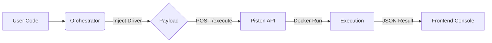

# ⚡ BRIKCODE

> **System Design & Secure Online Judge Sandbox**

BRIKCODE is a lightweight, high-performance Online Judge (OJ) platform built to demonstrate **secure client-side orchestration** and **remote code execution**. It replicates the core functionality of platforms like LeetCode, featuring multi-language support, real-time compilation, and an integrated AI assistant.


## 🌟 Key Features

*   **Multi-Language Support**: Execute code in **Python 3.10**, **Java 15**, and **C (GCC)**.
*   **Secure Orchestration**: User code is wrapped with a hidden "Test Driver" on the client side before being sent for execution.
*   **Sandboxed Execution**: Utilizes the [Piston API](https://github.com/engineer-man/piston) to run code in ephemeral, isolated Docker containers.
*   **Real-time Proctoring**: Tracks browser tab focus and visibility to detect "cheating" attempts (Focus violations).
*   **AI-Powered Assistance**: Integrated Gemini AI chat for hints, complexity analysis, and architectural diagrams.
*   **Visual Architecture**: Built-in interactive diagrams explaining the system design of the sandbox itself.
*   **Rich Console**: Detailed feedback on Test Cases, Standard Output (stdout), and Error Handling (stderr).

## 🏗️ System Architecture

BRIKCODE utilizes a **Remote Execution Pattern**. Instead of evaluating code in the browser (which is insecure and slow) or managing a complex backend fleet, it acts as an orchestrator.

### The Execution Flow:

1.  **Input**: User writes code in the Monaco-like editor.
2.  **Injection**: The `Orchestrator Service` injects a language-specific **Test Driver** into the user's code. This driver contains:
    *   Hidden unit tests.
    *   Timing logic (for TLE detection).
    *   Memory usage tracking.
    *   JSON formatting for the final verdict.
3.  **Transport**: The bundled payload is sent via POST to the Piston execution engine.
4.  **Sandbox**: Code runs in a strict, network-disabled Docker container.
5.  **Verdict**: The frontend parses the raw stdout/stderr to determine `AC` (Accepted), `WA` (Wrong Answer), or `RE` (Runtime Error).



## 🚀 Getting Started

This project is built using **ES Modules (ESM)** via `importmap` and requires no heavy build step (like Webpack) to run in a browser, though a local server is required.

### Prerequisites

*   Node.js (optional, only if using a local dev server like Vite/http-server)
*   A modern browser (Chrome/Edge/Firefox)

### Installation

1.  **Clone the repository**
    ```bash
    git clone https://github.com/yourusername/brikcode.git
    cd brikcode
    ```

2.  **Serve the files**
    Because the app uses ES modules, you cannot open `index.html` directly from the file system. You must serve it via HTTP.

    *Using Python:*
    ```bash
    python3 -m http.server 8000
    ```

    *Using Node (http-server):*
    ```bash
    npx http-server .
    ```

3.  **Open in Browser**
    Navigate to `http://localhost:8000` (or the port shown in your terminal).

## 📂 Project Structure

```
/
├── components/          # React UI Components
│   ├── ArchitectureView.tsx # Explains the system design
│   ├── ChatInterface.tsx    # AI Assistant UI
│   ├── CodeEditor.tsx       # Textarea with Vim-like feel
│   ├── Console.tsx          # Execution results & Verdicts
│   ├── ImageAnalyzer.tsx    # AI Vision component
│   └── ProblemView.tsx      # Problem description renderer
├── services/
│   ├── geminiService.ts     # Google GenAI integration
│   └── orchestrator.ts      # The core logic: Drivers & Piston API
├── App.tsx              # Main Layout & State Management
├── index.html           # Entry point & Import Maps
├── index.tsx            # React Mount point
├── metadata.json        # Manifest
└── types.ts             # TypeScript interfaces
```

## 🛠️ Configuration

### API Keys
To use the AI features (Chat & Image Analysis), you must provide a Google Gemini API Key. The application handles this via the `services/geminiService.ts` (Note: Ensure your environment variables or key handling logic is secure).

### Piston API
By default, this project uses the public Piston API at `https://emkc.org/api/v2/piston`. For production use, it is recommended to self-host Piston.

## 🤝 Contributing

Contributions are welcome! Please open an issue or submit a pull request for any features, bug fixes, or documentation improvements.

1.  Fork the Project
2.  Create your Feature Branch (`git checkout -b feature/AmazingFeature`)
3.  Commit your Changes (`git commit -m 'Add some AmazingFeature'`)
4.  Push to the Branch (`git push origin feature/AmazingFeature`)
5.  Open a Pull Request

## 📄 License

Distributed under the MIT License. See `LICENSE` for more information.
